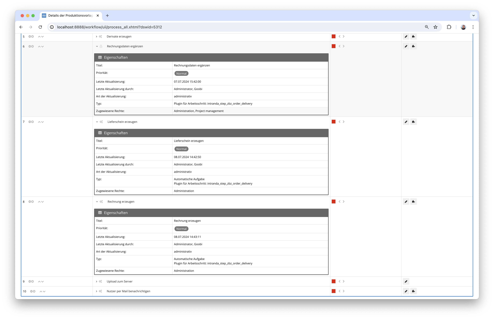
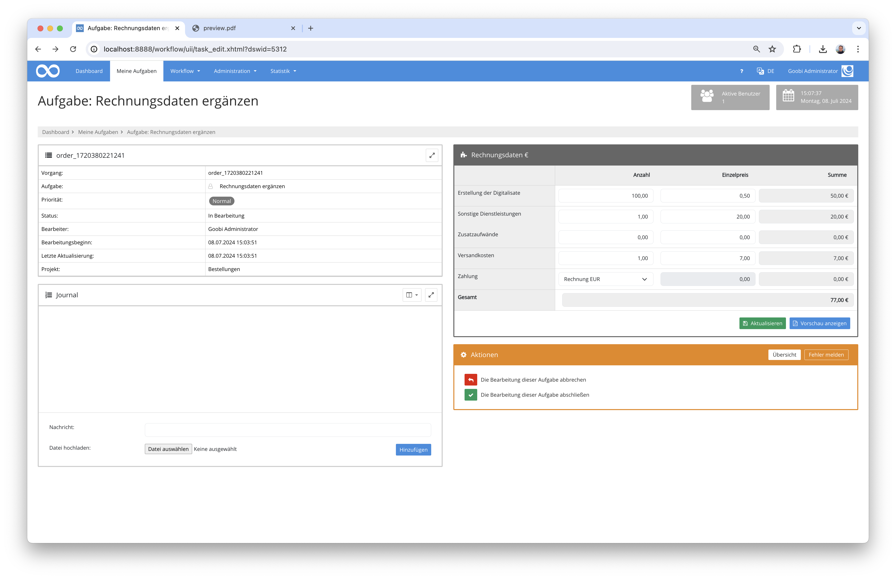

## Einführung
Die vorliegende Dokumentation beschreibt die Installation, Konfiguration und den Einsatz des Step-Plugins für die Erzeugung von Lieferscheinen und Rechnungen für Nutzerbestellungen an der Zentralbibliothek Zürich.

## Installation
Um das Plugin nutzen zu können, müssen folgende Dateien installiert werden:

```bash
/opt/digiverso/goobi/plugins/step/plugin-step-zbz-order-delivery-base.jar
/opt/digiverso/goobi/plugins/GUI/plugin-step-zbz-order-delivery-gui.jar
/opt/digiverso/goobi/config/plugin_intranda_step_zbz_order_delivery.xml
/opt/digiverso/goobi/xslt/delivery_invoice.xsl
/opt/digiverso/goobi/xslt/delivery_note.xsl
/opt/digiverso/goobi/xslt/delivery_preview.xsl
/opt/digiverso/goobi/xslt/letterhead.png
/opt/digiverso/goobi/xslt/preview.png
```

Nach der Installation des Plugins kann dieses innerhalb des Workflows für die jeweiligen Arbeitsschritte ausgewählt und somit teilweise manuell und teilweise automatisch ausgeführt werden. Ein Workflow könnte dabei beispielhaft wie folgt aussehen:


In diesem beispielhaften Workflow ist das Plugin insgesamt in drei Arbeitsschritten eingebunden. Der erste dieser Arbeitsschritte stellt dabei eine Nutzeroberfläche für die manuelle Bearbeitung durch einen Nutzer zur Verfügung, um zusätzliche Rechnungdaten erfassen zu lassen. Die beiden anderen Arbeitsschritte hingegen rufen das Plugin jeweils automatisch auf und erzeugen dabei einen Lieferschein und eine Rechnung im Dateisystem.




## Überblick und Funktionsweise
Das Plugin ist so konzipiert, dass es einen Lieferschein und eine Rechnung als PDF-Dateien auf der Basis von einer XSL-Transformation generiert. Die hierfür verwendeten Daten stammen einerseits aus Eigenschaften, die während der Bestellung durch den Nutzer an Goobi übertragen wurden (z.B. Adressinformationen, Kontaktdaten usw.). Andererseits werden für die Berechnung der abzurechnenden Kosten weitergehende Daten durch einen Bearbeiter in Goobi erfasst. Die Erfassung dieser Daten erfolgt dabei in einem manuellen Arbeitsschritt in den folgenden Formular:



Hier können die zusätzlichen Daten eingetragen und angepasst werden. Auch ist es an dieser Stelle möglich, nach Eingabe der zusätzlichen Rechnungsdaten eine Vorschau der künftigen Rechnung generieren zu lassen.


Nach Abschluß des Arbeitsschritts zur Datenerfassung kann das Plugin weitere Male im Workflow eingebunden werden, um PDF-Dateien gemäß der Layoutvorgaben aus den xsl-Dateien zu generieren.

Im weiteren Verlauf des Workflows können diese generierten PDF-Dateien, deren Speicherpfad und Benennung innerhalb der Konfigurationsdatei festgelegt werden können, z.B. an den Nutzer per E-Mail versendet werden.

## Konfiguration
Die Konfiguration des Plugins erfolgt in der Datei `plugin_intranda_step_zbz_order_delivery.xml` wie hier aufgezeigt:

{{CONFIG_CONTENT}}

{{CONFIG_DESCRIPTION_PROJECT_STEP}}

Parameter         | Erläuterung
------------------|----------------------------------------
`debugMode`       | Mit diesem Parameter läßt sich festlegen, dass bei der Generierung einer Rechnung oder eines Lieferscheins eine XML-Datei innerhalb des tmp-Ordners von Goobi abgelegt wird, die einen Einblick in die Berechnungsgrundlage für die Rechnung darstellt.
`xslt`            | Geben sie hier den Namen der `xsl-Datei` an, die für die Erzeugung der PDF-Datei verwendet werden soll.
`resultFolder`    | Legen Sie hier das Verzeichnis fest, wo die PDF-Datei gespeichert werden soll.
`resultFile`      | Definieren Sie hier den Namen der zu generierenden PDF-Datei.

