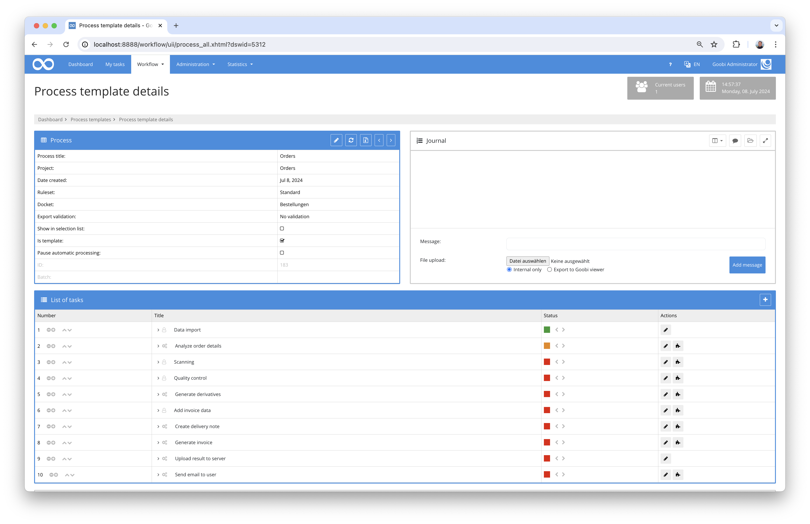
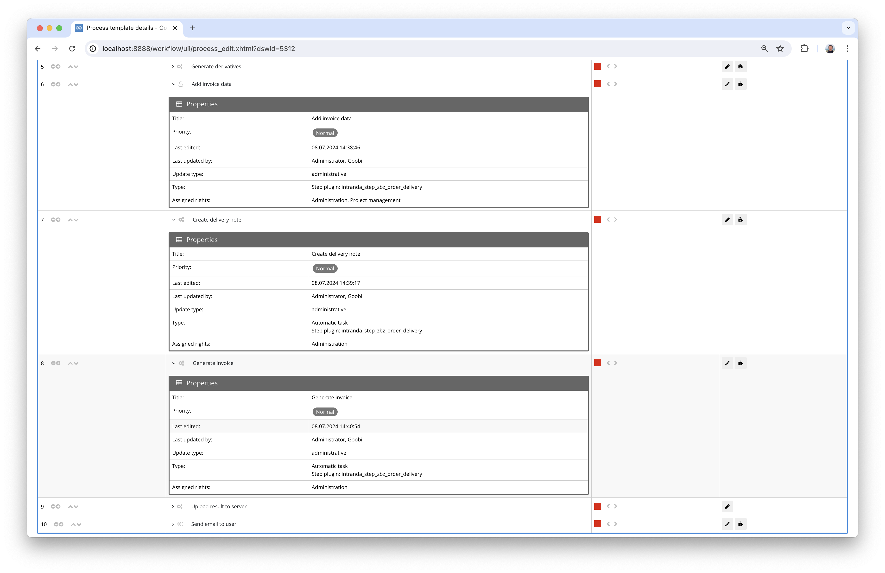

## Introduction
This documentation describes the installation, configuration and use of the Step plug-in for generating delivery notes and invoices for user orders at the Zentralbibliothek Zürich.

## Installation
In order to use the plugin, the following files must be installed:

```bash
/opt/digiverso/goobi/plugins/step/plugin-step-zbz-order-delivery-base.jar
/opt/digiverso/goobi/plugins/GUI/plugin-step-zbz-order-delivery-gui.jar
/opt/digiverso/goobi/config/plugin_intranda_step_zbz_order_delivery.xml
/opt/digiverso/goobi/xslt/delivery_invoice.xsl
/opt/digiverso/goobi/xslt/delivery_note.xsl
/opt/digiverso/goobi/xslt/delivery_preview.xsl
/opt/digiverso/goobi/xslt/letterhead.png
/opt/digiverso/goobi/xslt/preview.png
```

Once the plugin has been installed, it can be selected within the workflow for the respective workflow steps and thus executed manually in some cases and automatically in others. A workflow could look like the following example:



In this exemplary workflow, the plugin is integrated in a total of three workflow steps. The first of these steps provides a user interface for manual processing by a user in order to enter additional invoice data. The other two steps, on the other hand, call up the plugin automatically and generate a delivery note and an invoice in the file system.




## Overview and functionality
The plugin is designed to generate a delivery note and an invoice as PDF files on the basis of an XSL transformation. On the one hand, the data used for this comes from properties that were transferred to Goobi by the user during the order process (e.g. address information, contact details, etc.). On the other hand, additional data is recorded by a processor in Goobi in order to calculate the costs to be invoiced. This data is entered manually in the following form:


The additional data can be entered and customised here. It is also possible at this point to generate a preview of the future invoice after entering the additional invoice data.


Once the data capture step has been completed, the plugin can be integrated further times in the workflow to generate PDF files from the xsl files in accordance with the layout specifications.

In the further course of the workflow, these generated PDF files, whose storage path and naming can be defined within the configuration file, can be sent to the user by e-mail, for example.

## Configuration
The plugin is configured in the file `plugin_intranda_step_zbz_order_delivery.xml` as shown here:

{{CONFIG_CONTENT}}

{{CONFIG_DESCRIPTION_PROJECT_STEP}}

Parameter         | Explanation
------------------|----------------------------------------
`debugMode`       | This parameter can be used to specify that when an invoice or delivery note is generated, an XML file is stored within Goobi's tmp folder which provides an insight into the calculation basis for the invoice.
`xslt`            | Enter the name of the 'xsl file' to be used to create the PDF file.
`resultFolder`    | Specify the directory where the PDF file is to be saved here.
`resultFile`      | Define the name of the PDF file to be generated here.

